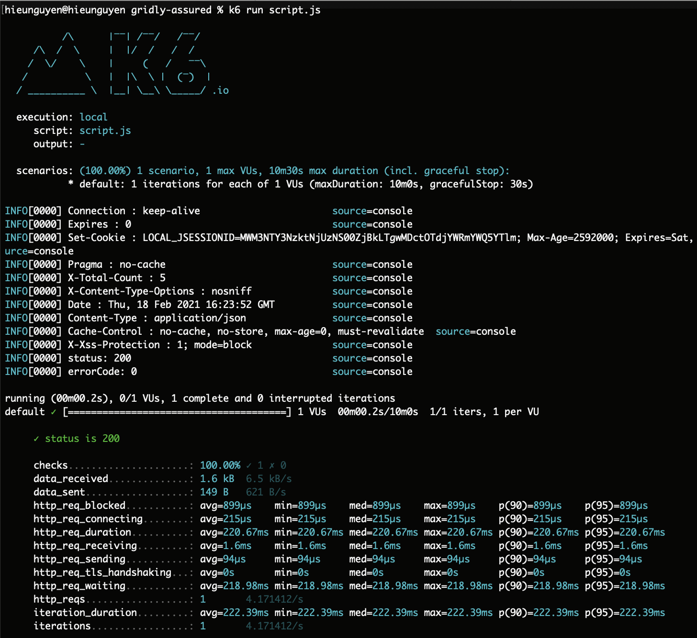

# Gridly Assured

> The one who doesn't fall, doesn't stand up.

\- Fedor Emelianenko

---

**Gridly Assured** is a simple and easy project to load-test [Gridly API](https://www.gridly.com/docs/api/#introduction) using [K6 load-testing framework](https://k6.io/). It's also a good sketeton for testing other APIs later on.

